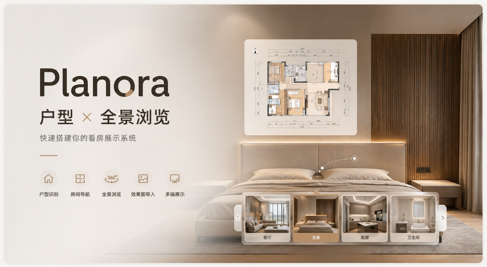

# Planora

> 用于本地 VR 预览、房间切换和户型图导航。



[在线体验](https://planora-vr.netlify.app/)

---

## 项目简介

Planora 是一个面向户型展示与全景浏览的轻量站点。

它不依赖固定房间模板，而是通过一张白底户型导航图来识别房间热区和房间名称，再把这些结果直接转换成首页可浏览的房间列表。配合批量导入的房间效果图，能够很快搭建一个可演示、可部署、可离线导出的全景展示站点。

适合场景：

- 家装方案展示
- 户型讲解页
- 360 全景看房演示
- image2 效果图快速落地成网页
- 单户型、单风格项目的本地或线上交付

---

## 核心能力

- 360° 全景房间浏览
- SVG 户型热区导航
- PaddleOCR 房间名识别
- 单项目单风格展示
- 效果图文件夹批量导入
- 浏览器本地保存图片资源
- 首页热区图与展示户型图放大预览
- 一键导出离线包（zip）

---

## 技术栈

- `Vite`
- `React 18`
- `TypeScript`
- `Pannellum`
- `@paddleocr/paddleocr-js`
- `JSZip`

---

## 在线地址

- [https://planora-vr.netlify.app/](https://planora-vr.netlify.app/)

---

## 本地开发

```bash
npm install
npm run dev
```

默认地址：

```text
http://localhost:5173
```

设置页入口：

```text
http://localhost:5173/?lab=floorplan
```

---

## 当前工作流

### 1. 上传白底户型导航图

在设置页上传一张用于识别的白底二维户型图。

建议：

- 白底
- 黑灰线条
- 房间边界闭合
- 房间名称尽量位于房间中心位置

### 2. 自动分析热区

系统会先分析封闭房间区域，生成 SVG 热区。

如果边界不理想，可以通过以下参数调整：

- 线条阈值
- 膨胀像素
- 最小面积

然后重新分析热区。

### 3. 自动识别热区名称

点击 `自动识别热区名称` 后，PaddleOCR 会读取房间名。

规则：

- 默认热区名会先是 `区域 1 / 区域 2 / ...`
- OCR 识别到的名称会替换默认名
- 识别不准时可以手动改名
- 不想显示到首页的区域，可以关闭“可点击”

只有：

- 有名字
- 已启用

的热区，才会出现在首页。

### 4. 选择当前项目风格

首页现在只显示一个风格。

你在设置页选中的当前项目风格，会直接成为首页显示的风格。

### 5. 批量导入效果图文件夹

识别出房间名之后，页面会出现 `选择文件夹批量导入`。

匹配规则：

- 文件名主干 = 房间名
- 不区分扩展名类型
- 支持：`jpg / jpeg / png / webp`

例如识别出的房间名是：

- `主卧A`
- `客厅`
- `书房`

那么文件夹中可以是：

```text
主卧A.jpg
客厅.png
书房.webp
```

如果文件夹中包含：

```text
户型图.png
```

或：

```text
户型图.jpg
```

系统会把它作为首页左下角的展示户型图。

说明：

- 这张展示户型图不参与底部 SVG 热区叠加
- 所以不会影响热点图对齐

### 6. 一键应用到首页

点击 `一键应用到首页` 后，首页会同步：

- 房间名称
- 热区轮廓
- 启用状态
- 底部 SVG 热区图
- 当前风格
- 已导入的房间效果图
- 左下角展示户型图

首页左侧房间列表只显示：

- 有名字
- 已启用

的热区。

### 7. 导出离线包

设置页支持导出离线包，例如：

```text
planora-意式风格-offline.zip
```

离线包特点：

- 直接解压后打开 `index.html` 即可查看
- 不需要联网
- 已内嵌当前导出时需要的图片资源
- 包含首页查看能力
- 不包含设置页、OCR 和重新编辑能力

建议顺序：

1. 先确认首页效果正常
2. 再导出离线包
3. 使用最新导出的 zip 测试，不要反复测试旧包

---

## 文件夹导入规则

### 房间效果图

按 `文件名主干 = 房间名` 命名。

系统不区分：

- `.jpg`
- `.jpeg`
- `.png`
- `.webp`

只要主文件名一致即可。

### 展示户型图

如果文件夹中包含：

- `户型图.png`
- `户型图.jpg`

会显示在首页左下角的展示区。

### 导入失败提示

如果提示 `请检查效果图命名`，通常是以下原因：

- 文件名和房间名不一致
- 有文件未匹配到任何房间
- 某些房间还没有对应图片

---

## 首页结构

### 左侧栏

- 站点标题
- 当前风格
- 房间列表
- 当前状态
- 展示户型图

### 主视图区

- 360 全景浏览
- `yaw / pitch / fov`
- 缩放 / 全屏控件

### 底部户型图区

- SVG 热区图
- 当前房间高亮
- 线框索引
- 放大 SVG 热区图

---

## 数据与存储说明

当前导入的房间图片和展示户型图保存在浏览器本地。

这意味着：

- 当前浏览器里导入后可以直接使用
- 更换浏览器、设备或部署地址后，需要重新导入
- 这种方式不依赖后端，适合本地演示和免费静态部署

离线包是另一种交付形式：

- 将当前首页查看结果打包成 zip
- 双击 `index.html` 即可离线查看
- 不依赖浏览器本地数据库

---

## 部署

当前项目已适配静态部署。

推荐：

- `Netlify`
- `Cloudflare Pages`
- `Vercel`

仓库内已包含：

- `netlify.toml`

如果使用 Netlify：

- Build command：`npm run build`
- Publish directory：`dist`

---

## 适用项目类型

Planora 更适合：

- 户型变化较大、不想维护固定房间模板的项目
- 单户型、单风格的快速交付页面
- 本地展示、销售演示、设计评审页
- 需要同时支持在线访问和离线打包的场景

---

## 后续可继续优化

- OCR 识别稳定性继续优化
- 热区识别精度优化
- 离线包样式继续对齐首页
- 图片资源持久化到服务端
- 多风格项目切换
- 首屏性能优化

---

## License

仅用于当前项目开发与演示。
